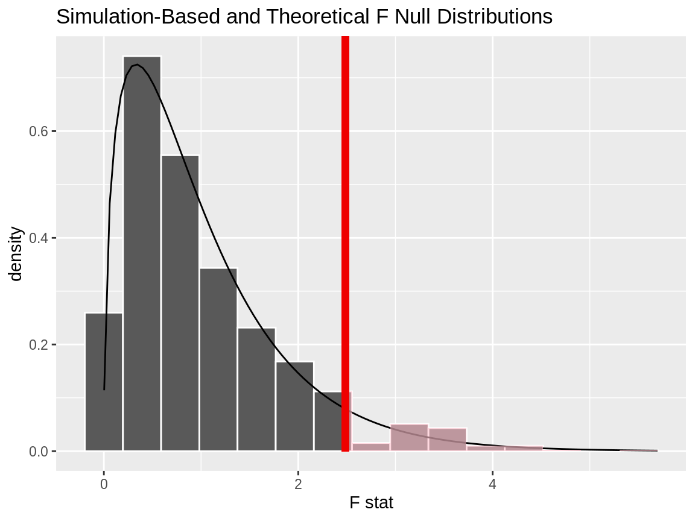

```{r set-theme, include=FALSE}
library(xaringanthemer)
style_duo_accent(
  primary_color      = "#003C71", # pantone classic blue
  secondary_color    = "#009FDF", # pantone baby blue
  header_font_google = google_font("Raleway"),
  text_font_google   = google_font("Raleway", "300", "300i"),
  code_font_google   = google_font("Source Code Pro"),
  text_font_size     = "30px"
)
```


```{r load-packages, message=FALSE, echo=FALSE}
knitr::opts_chunk$set(echo = TRUE, 
                      message = FALSE, 
                      warning = FALSE, 
                      out.width = '70%', 
                      fig.align = 'center', 
                      tidy = FALSE)
options(scipen = 1, digits = 3)
library(ggplot2, warn.conflicts = FALSE, quietly = TRUE)
theme_set(theme_minimal())
```

```{r xaringanExtra, echo=FALSE}
xaringanExtra::use_xaringan_extra(c("tile_view", "editable","panelset", "tachyons","webcam"))

```
 
# Welcome


.pull-left-narrow[
```{r fig.align="center", echo=FALSE, alt="Leo", out.width="80%"}
knitr::include_graphics("img/intro/leo_belzile_photo.png")
```
]
.pull-right-wide[
.midi[
- Assistant professor of Decision Sciences
- PhD from EPFL (Switzerland)
- I study extreme value analysis (floods, heatwaves, etc.)
- I come from the Gaspe Peninsula
- I enjoy hiking in the Alps
- Expectations: active learning, participation in class, feedback!


[Let's meet](https://etherpad.wikimedia.org/p/3IXOgvBHSr-hn4pV6AoC)
- Where are you from?
- Academic background?
- What are your expectations for this course?
]
]


---

### Zoom breakout rooms

A breakout room is used for sessions in small groups.

- Different settings (you can share content/screen).  
- You can ask me for help; I will get a notification.
- I can send everyone messages (pop-up)
- You can't access the history of the chat from the main meeting while in the breakout rooms.
- Please don't leave the breakout room until I instruct you to!
- Your microphone will be muted when you come back.
- When I end the breakout sessions, there is a one minute delay before going back (none if you leave them immediately).


---

## Zoom practice

We will practice Breakout rooms, which are small group session.


**Icebreaking activity**: introduce yourself to classmates and give five facts about yourself, e.g., 
  - I live in Tunisia
  - I am a mountain climber
  - I own a labrador named Daisy
  - I used to work as a photographer
  - I have an engineering background

---

# Recap of week 1

- Testing procedure
- Central limit theorem
- Graphics
- Exploratory data analysis

--


# Question and answer (Q&A) period

- Raise your hand to ask a question.
  - When asked, unmute yourself
- or post question on the chat.


---

## Testing

Statistical inference is about drawing conclusion for population based on a representative sample.

--

- Postulate a model (often implicitly)
- Fix hypotheses
- Choose and compute the test statistic
- What if $\mathscr{H}_0$? Figure out expected behaviour of test
    - using asymptotic arguments (central limit theorem)
    - exact distribution (nonparametric tests, small samples)
    - using simulations from the null model (e.g., permutation, bootstrap)

---

```{r fig.align="center", echo=FALSE, alt="Null distribution", out.height="70%"}

```
.small[
*Often, the null hypothesis is derived by making assumptions about the underlying distribution of the data.*
]
---

## Graphics

Single variable:

- continuous: .can-edit[ -]
- categorical: .can-edit[ -]

Two variables:

- continuous ${}^2$: .can-edit[ -]
- continuous $\times$ categorical: .can-edit[ -]
- categorical ${}^2$: .can-edit[ -]

---

### Improving graphs

```{r fig.align="center", echo=FALSE, alt="Fix your graph", out.height="70%"}
knitr::include_graphics("img/w1/advisor_email.png")
```
.center[
.tiny[
[Désirée de Leon and Hasse Wallum](https://github.com/tinystats/teacups-giraffes-and-statistics/blob/master/images/02_bellCurve/advisor_email.png), CC BY-NC-ND 2.0]
]

---

.center[

# Wooclap poll
]

- Go to https://www.wooclap.com/STATMOD1 to begin the poll

--

.center[
# **SAS** onDemand demo
]

---

### Workshop 

Download the `.zip` folder containing 30 graphs.

- Does the graph tell a story (i.e., is it standalone?)
- What are the variables and the mapping?
- Variable type: is the choice of geometry adequate?
- Is the graph complete? 
- Highlight good features and improvement points

---

### Assignment 1

Pick a graph and repeat this commentary exercise

Good sources include 

- the Twitter handles: 
    - BBC [`@BBCNewsGraphics`]
    - Washington Post [`@PostGraphics`]
    - New York Times [`@nytgraphics`]
    - etc.
- newspaper and magazine 
- data providers, e.g.,  [US Census](https://www.census.gov/library/visualizations/)


---


.discussion[]

Perform and exploratory data analysis of the `insurance` dataset in small groups.

.pull-left[
### Questions

.can-edit[-]
]
.pull-right[
### Summary

.can-edit[-]

]
