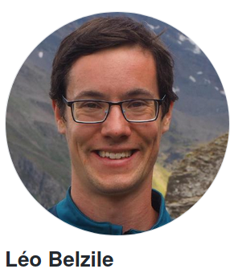
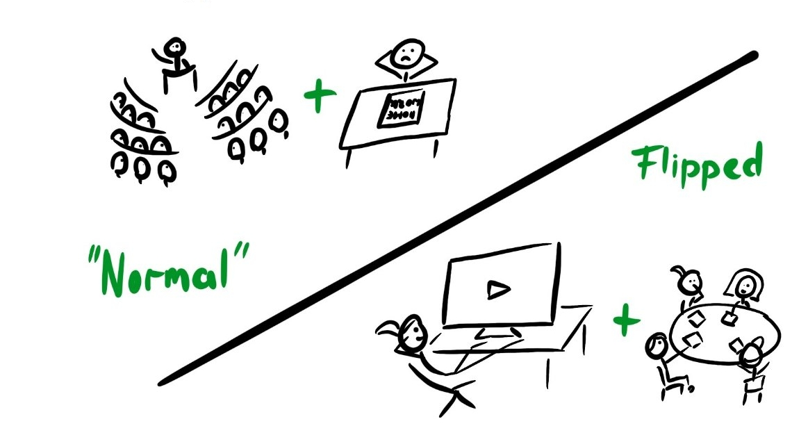
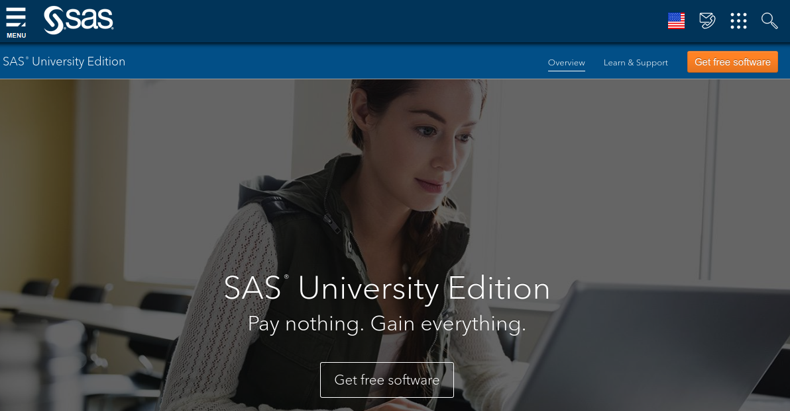

```{r child = "setup.Rmd"}
```

```{r set-theme, include=FALSE}
library(xaringanthemer)
style_duo_accent(
  primary_color      = "#003C71", # pantone classic blue
  secondary_color    = "#009FDF", # pantone baby blue
  header_font_google = google_font("Raleway"),
  text_font_google   = google_font("Raleway", "300", "300i"),
  code_font_google   = google_font("Source Code Pro"),
  text_font_size     = "30px"
)
```


```{r load-packages, message=FALSE, echo=FALSE}
knitr::opts_chunk$set(echo = TRUE, 
                      message = FALSE, 
                      warning = FALSE, 
                      out.width = '70%', 
                      fig.align = 'center', 
                      tidy = FALSE)
options(scipen = 1, digits = 3)
library(ggplot2, warn.conflicts = FALSE, quietly = TRUE)
theme_set(theme_minimal())
```

```{r xaringanExtra, echo=FALSE}
xaringanExtra::use_xaringan_extra(c("tile_view", "editable","panelset", "tachyons","webcam"))

```

# Welcome


.pull-left-narrow[
```{r fig.align="center", echo=FALSE, alt="Leo", out.width="80%"}

```
]
.pull-right-wide[
.midi[
- Assistant professor of Decision Sciences
- I study extreme value analysis (floods, heatwaves, etc.)


[Let's meet](https://etherpad.wikimedia.org/p/3IXOgvBHSr-hn4pV6AoC)
- Where are you from?
- Academic background?
- Current city/region or country?
- What are your expectations for this course?
]
]

---

# Organization

- Weekly meetings via **Zoom** (Wednesday, 15:30-18:30 Montreal time).
- All of the course material can be downloaded from the course website: [`https://lbelzile.github.io/statmod/`](https://lbelzile.github.io/statmod/)
.midi[
- course notes
- video records
- **R** package with datasets and quiz
- exercises and solutions
- **SAS**/**R** demos
    ]
- Submit your assignments/projects via *ZoneCours*
- Ask course-related questions on **Piazza**: [`piazza.com/hec.ca/fall2020/math60604a`](piazza.com/hec.ca/fall2020/math60604a)
- For other matters, I am best reached by *email*: [`leo.belzile@hec.ca`](mailto:leo.belzile@hec.ca)

---

# Course content


> *All models are wrong, but some are useful.* 
.right[— Georges Box]


1. Basic principles in inference and statistical modelling
2. Linear models
3. Generalized linear models
4. Models for longitudinal data and correlated data
5. Linear mixed models
6. Introduction to survival analysis

---


# Grading

- Three assignments, each worth 15% (partly in teams)
    - short questions (multiple choices)
    - programming questions
    - data analysis
--
- Data analysis project (25%)
    - create your own assignment!
--
- Final exam (30%, format TBD depending on HEC directives) 
 
---

## Flipped classroom

.center[
```{r fig.align="center", echo=FALSE, out.width="80%"}

```
.small[
Flipped class (drawing by Heidi Seibold, under CC-BY 4.0 license)
]
]


---


.question[
What is the format of the course?
]

--
.pull-left[
At home:
- reading course notes
- slides with videos 
- quiz
- exercises (with solutions)
]

--

.pull-right[
In class:
- weekly summary
- question period
- group workshop and discussions
]

---

.question[
What is the workload for this course?
]

--

- 3 credits = 135 hours of work
- an average of 9 hours per week
- do not estimate the initial time investment:
    - installing required software
    - learning programming basics
    - getting up to speed with prerequisites 

---

.question[
What is the target audience?
]

--

Students enrolled in the Data Science and Business Analytics M.Sc program. 

Students admitted normally have a bachelor in
 - engineering
 - physics or 
 - mathematics.

Basic knowledge of calculus and linear algebra is assumed.

---

.question[
What are the prerequisites?
]

--

A first course in probability/statistic covering the following notions:

.pull-left[
+ probability axioms and combinatorics
+ random variables
    + moments (expectation, variance, correlation)
    + discrete distributions: Bernoulli, binomial, Poisson
    + continuous distributions: uniform, exponential, normal
]

.pull-right[
+ descriptive statistics
+ hypothesis tests
+ comparison of means and proportions (one and two samples)
+ simple linear regression
]

---

.question[
Will there be programming?
]

--
.sample-answer[
*Yes*. We will cover the basics of **SAS** (and **R**) to fit models and visualized data.
]
- I will provide code only for exercises and slides.

You must provide your code otherwise for assignments/group projects

- I should be able to reproduce *exactly* your analyses.
- submit as a `.txt` file (otherwise, you won't be able to submit your work on *Zonecours*) 
- use UTF8 encoding 
- follow the instructions for naming scripts/files
(hint: $\neq$ `mycode.sas`)

---

.question[
What software will we use in class?
]

According to the official course outline, **SAS** (Base/Stat). You must install the software on your computer. A tutorial (video recorded) will teach you the basics.

--

- This is the only course in your program that uses this programming language. Why bother with it, then?
.midi[
- comparative advantage if you know multiple programming languages.
- frequently used by business
    - they maintain databases with **SAS**
    - the software costs a lot of money ($ $ $)
    - stable, the company offers support (unlike open source)
    - code legacy blocks evolution towards modern languages (Python, R, etc.)
]

---

I recommand (in particular for Unix system)[ **SAS University Edition**](https://www.sas.com/en_us/software/university-edition.html) (run using a virtual machine through a web browser)

.center[
```{r fig.align="center", echo=FALSE, alt = "SAS University Edition", out.width="60%"}

```
]

.midi[
IT services at HEC provide a copy of the software via their platform for Windows  [(free license, but they charge ~35$ for the download)](https://www.hec.ca/dti/assistance/pedagogie/logiciels_enseignes/Procedure-SAS.pdf).
]

---

### **R**

I am avid support of open-access software and of **R**, a programming language written by the community

 - its free!
 - multi-platform support
 - download from [cran.r-project.org](https://cran.r-project.org/)
 - used in the course notes
 - I recommand the IDE [**RStudio**](https://rstudio.com/)
 
---

.question[
What are the prof expectations?
]

--

- Active participation in class: students are expected to be in class (even virtually)
.midi[
- if this is impossible, let me know
- small-group discussions
- ask questions! there is no silly question
]
--

- Autonomy: you are sole responsible for your learning.
.midi[
- stay up to date and do your readings 
- don't stay in the dark: ask questions (to me or your peers)!
]
--

- Feedback: problems or unclear explanations? let me know asap
.midi[
- online semester = friction points (internet connection, lack of human contact, etc.)
- many tools = longer period to adapt to uncharted territory
]
---

# Inclusive and respectful environment

Even if the class is virtual, be respectful. Harassment, discriminatory views, etc. are not tolerated.

--

Let me know if

- I can do something to improve the course experience for you or other students
- a statement or attitude makes you uncomfortable
- your name/prefered pronoun/gender differs from the information provided on *HEC en ligne*
- your performance is affected by external factors: I will do my past to help you or direct you to external resources.

---

# Plagiarism

Please don't. 

.midi[
- if you take and adapt code from elsewhere (e.g., `StackOverflow`), cite your sources!
- you must program yourself your code for individual assignments (discussion with peers is okay, but code sharing, copy paste or similar wording is punishable)

]

