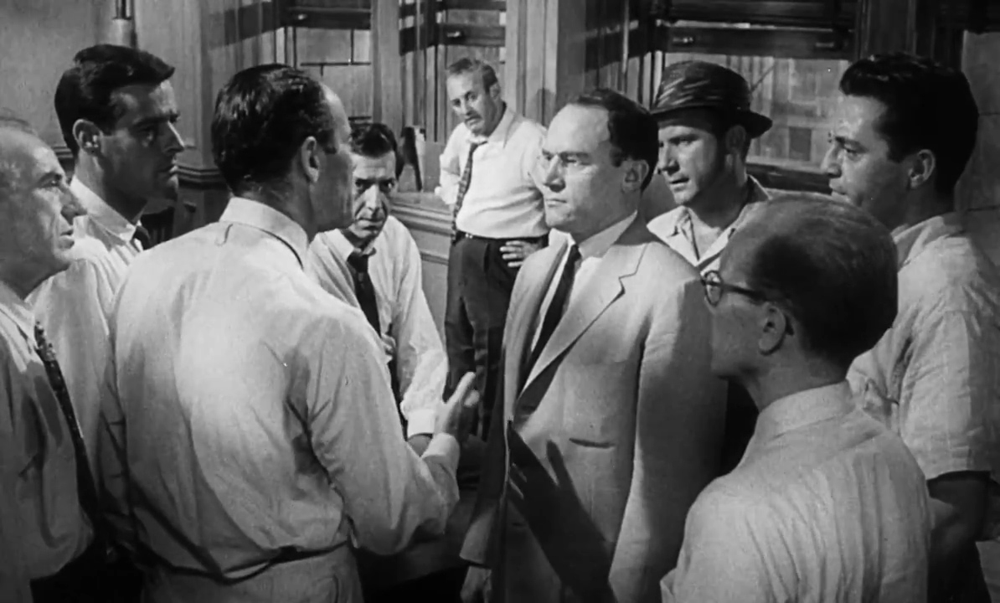
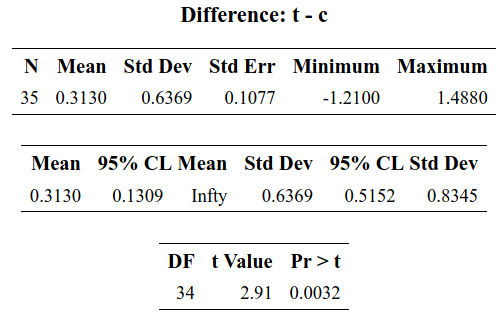
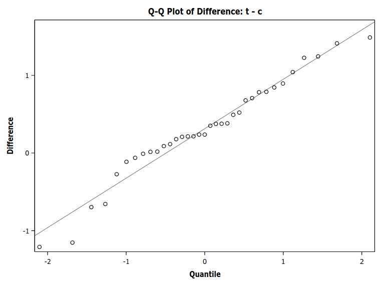

```{r child = "setup.Rmd"}
```

```{r set-theme, include=FALSE}
library(xaringanthemer)
style_duo_accent(
  primary_color      = "#003C71", # pantone classic blue
  secondary_color    = "#009FDF", # pantone baby blue
  header_font_google = google_font("Raleway"),
  text_font_google   = google_font("Raleway", "300", "300i"),
  code_font_google   = google_font("Source Code Pro"),
  text_font_size     = "30px"
)
```


```{r load-packages, message=FALSE, echo=FALSE}
knitr::opts_chunk$set(echo = TRUE, 
                      message = FALSE, 
                      warning = FALSE, 
                      out.width = '70%', 
                      fig.align = 'center', 
                      tidy = FALSE)
options(scipen = 1, digits = 5)
library(ggplot2, warn.conflicts = FALSE, quietly = TRUE)
theme_set(theme_minimal())
```


```{r xaringanExtra, echo=FALSE}
xaringanExtra::use_xaringan_extra(c("tile_view", "editable","panelset", "webcam"))
htmltools::tagList(
  xaringanExtra::use_clipboard(
    button_text = "<i class=\"fa fa-clipboard\"></i>",
    success_text = "<i class=\"fa fa-check\" style=\"color: #90BE6D\"></i>",
    error_text = "<i class=\"fa fa-times-circle\" style=\"color: #F94144\"></i>"
  ),
  rmarkdown::html_dependency_font_awesome()
)
xaringanExtra::use_extra_styles(
  hover_code_line = TRUE,         #<<
  mute_unhighlighted_code = TRUE  #<<
)
```

# Hypothesis testing

.center[**Trial analogy**]

```{r twelveangrymen, echo = FALSE, out.width="65%"}

```
.figcaption[Screenshot of the courtoom drama _Twelve Angry Men_ (1957)]

---

### Recipe

An hypothesis test is a binary decision rule

Below are the different steps to undertake:
--

1. Define the variables of interest
2. Formulate the alternative and the null hypotheses, $\mathscr{H}_a$ and $\mathscr{H}_0$
3. Choose the test statistic and compute the latter on the sample
4. Compare the numerical value with the null distribution
5. Obtain the *p*-value
6. Conclude in the setting of the problem

---

### Tech3Lab


```{r tech3lab, echo = FALSE, out.width="85%"}

```


---

### Texting while walking: a dangerous habit?


```{r texter, echo = FALSE, out.width="85%"}
knitr::include_graphics('img/tests/01-intro-texter.jpg')
```

---

### Study details

- 35 participants took part in the study. 
- Each person had to walk on a treadmill in front of a screen where obstacles were projected.
- In one of the sessions, the subjects walked while talking on a cell
phone, whereas in another session, they walked while texting.
- The order of these sessions was determined *at random*.
- Different obstacles were randomly projected during the session.
- We are only interested in one kind of scenario: a cyclist riding towards the participant.

---

### Characteristics

- Population: adults
- Sample: 35 individuals
- Variables:
  - Time to perceive an obstacle: quantitative
  - Distraction type (cellphone call or texting): nominal variable


- Variable of interest: time (in seconds) that it takes for a person to notice the obstacle when walking while texting or talking on a cell phone (measure through an encephalogram)

---

### \#1. Define the variables of interest

- $\mu_{\texttt{c}}$ be the average reaction time (in seconds) during a call (`c`)
- $\mu_{\texttt{t}}$ be the average reaction time (in seconds) while texting (`t`)

--

### \#2. Formulate the null and alternative hypothesis

- Hypothesis of interest: does texting increases distraction?
    - $\mathscr{H}_a: \mu_{\texttt{t}} > \mu_{\texttt{c}}$ (one-sided)
- Null hypothesis (Devil's advocate)
    - $\mathscr{H}_0: \mu_{\texttt{t}} \leq  \mu_{\texttt{c}}$

Express the hypothesis in terms of the difference of means
\begin{align*}
\mathscr{H}_a: \mu_{\texttt{t}} - \mu_{\texttt{c}}>0.
\end{align*}

---

### \#3.Choose the test statistic 

We compare the difference of the mean reaction time

- one-sample _t_-test for $\texttt{t}-\texttt{c}$ (paired _t_-test) 
\begin{align*}
T_D=\frac{\overline{D}-\mu_0}{\mathsf{se}(\overline{D})}
\end{align*}
- $\overline{D}$ is the mean difference in the sample. 
- Under $\mathscr{H}_0: \mu_0=\mu_{\texttt{t}}-\mu_{\texttt{c}}=0$.
- The standard error of $\overline{D}$ is $\mathsf{se}(\overline{D})=S_D/\sqrt{n}$, where $S_D$ is the standard deviation of the variables $D_i$ and $n$ the sample size.


---

.panelset[
.panel[.panel-name[**SAS** code]

```{sas distraction_code_SAS, echo = TRUE, eval = FALSE}
proc ttest data=statmod.distraction side=u;
paired t*c;
run;
```

]
.panel[.panel-name[**SAS** output]
.pull-left[
```{r distraction_SAS1, echo = FALSE, out.width="100%"}

```
]
.pull-right[
```{r distraction_SAS2, echo = FALSE, out.width="100%"}

```
]

]
.panel[.panel-name[**R** code]
```{r distraction_code, eval = FALSE, echo = TRUE}
data(distraction, package = "hecstatmod")
with(distraction,
     t.test(t-c, alternative = "greater", mu = 0) 
     )
```
]
.panel[.panel-name[**R** output]

```{r distraction, eval = TRUE, echo = FALSE}
url <- "https://lbelzile.bitbucket.io/MATH60604/distraction.sas7bdat"
distraction <- haven::read_sas(url)
with(distraction,
     t.test(t-c, alternative = "greater", mu = 0) 
     )
```
]


]

---

### \#4. Compare the statistic with the null distribution

The null distribution is Student-_t_ with 34 degrees of freedom, $\mathsf{St}_{34}$. 

We are only interested in the probability that $T_D > 2.91$ under $\mathscr{H}_0$.

--

### \#5. Obtain a *p*-value

The _p_-value is $0.0032$, which is smaller than $\alpha=5\%$.

### \#6. Conclude in the setting of the problem

We reject $\mathscr{H}_0$, meaning that the reaction time is significantly higher when texting than talking on the cellphone while walking.

The estimated mean difference is $0.313$ seconds.

