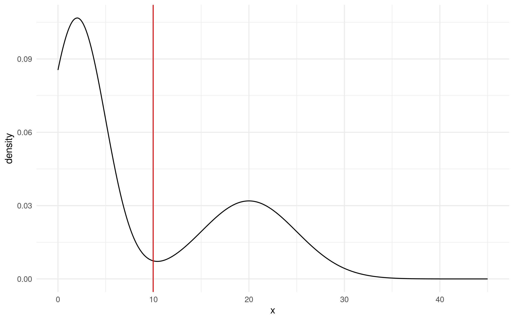
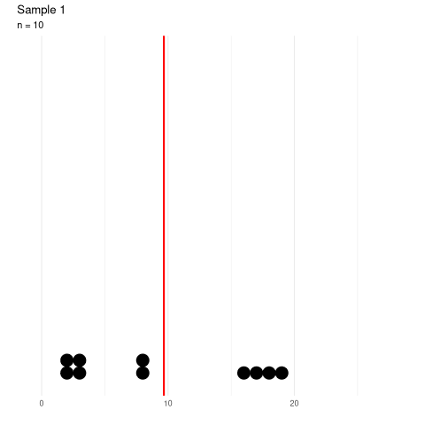
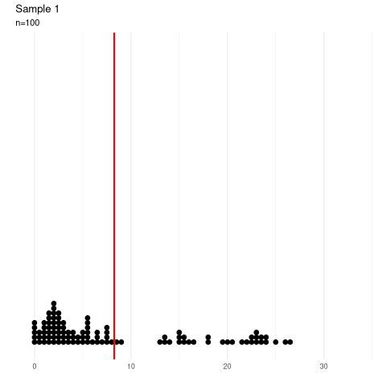
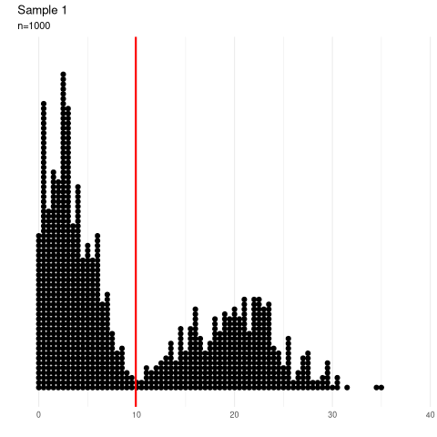
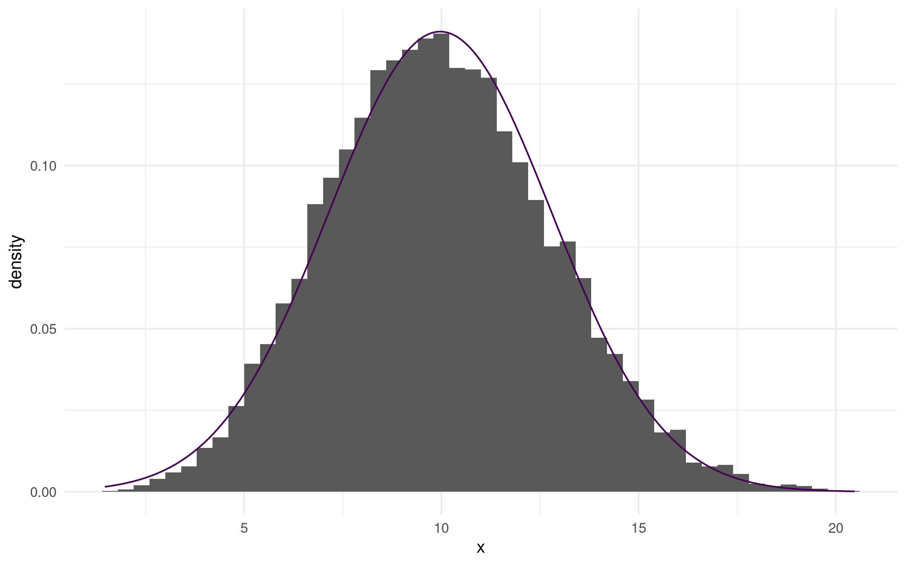
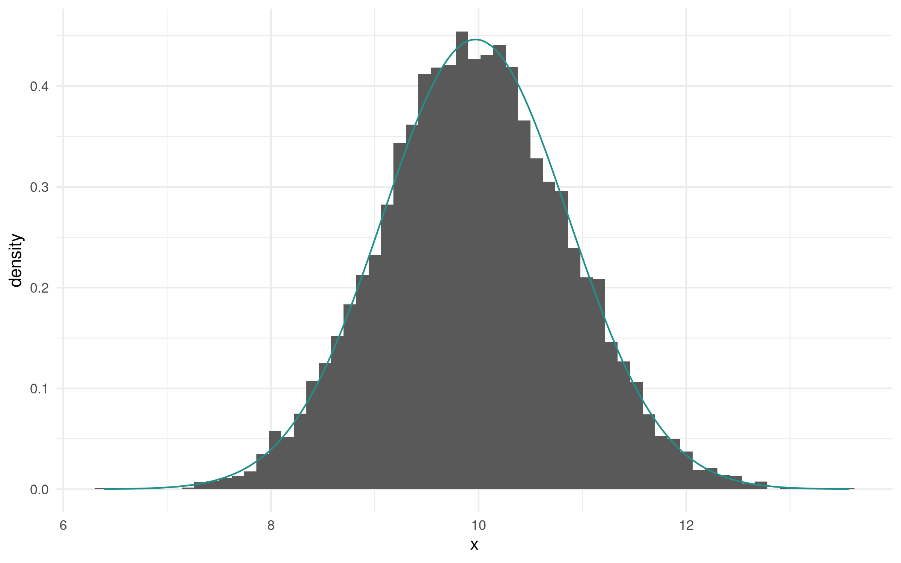
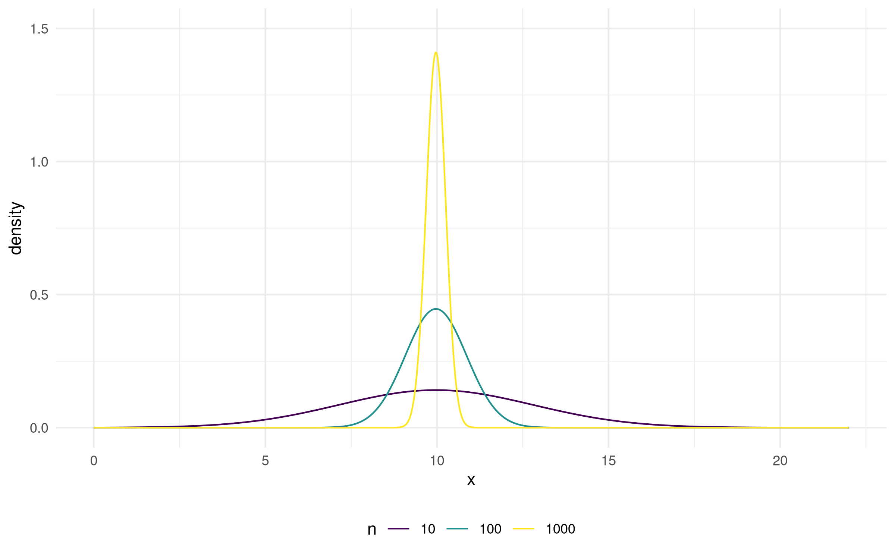
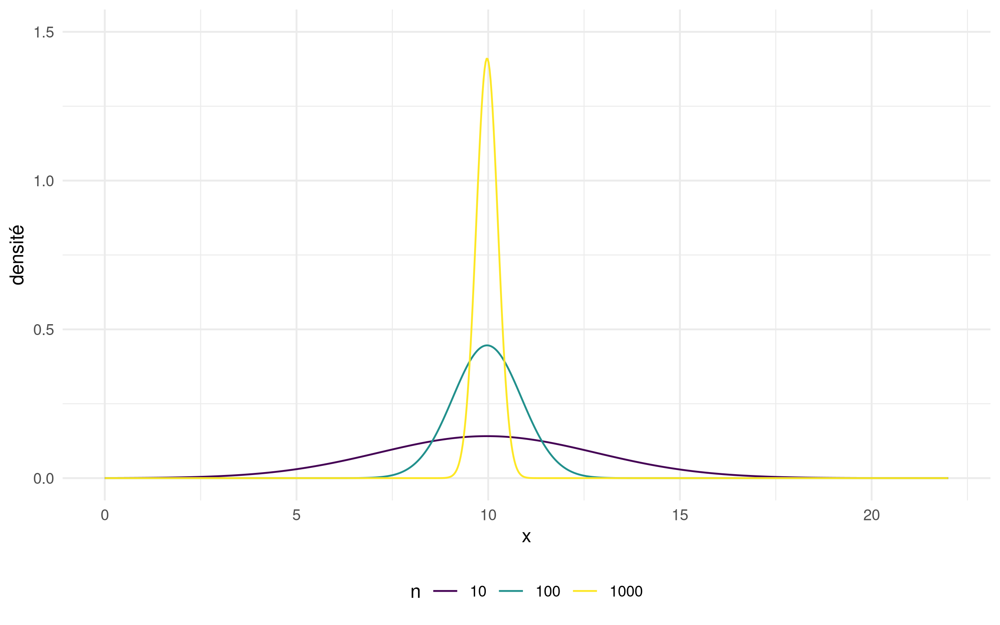

```{r child = "setup.Rmd"}
```

```{r set-theme, include=FALSE}
library(xaringanthemer)
style_duo_accent(
  primary_color      = "#003C71", # pantone classic blue
  secondary_color    = "#009FDF", # pantone baby blue
  header_font_google = google_font("Raleway"),
  text_font_google   = google_font("Raleway", "300", "300i"),
  code_font_google   = google_font("Source Code Pro"),
  text_font_size     = "30px"
)
```


```{r load-packages, message=FALSE, echo=FALSE}
knitr::opts_chunk$set(echo = TRUE,
                      message = FALSE,
                      warning = FALSE,
                      out.width = '70%',
                      fig.align = 'center',
                      tidy = FALSE)
options(scipen = 1, digits = 3)
library(ggplot2, warn.conflicts = FALSE, quietly = TRUE)
theme_set(theme_minimal())
xaringanExtra::use_xaringan_extra(c("tile_view", "editable","panelset", "webcam"))
htmltools::tagList(
  xaringanExtra::use_clipboard(
    button_text = "<i class=\"fa fa-clipboard\"></i>",
    success_text = "<i class=\"fa fa-check\" style=\"color: #90BE6D\"></i>",
    error_text = "<i class=\"fa fa-times-circle\" style=\"color: #F94144\"></i>"
  ),
  rmarkdown::html_dependency_font_awesome()
)
xaringanExtra::use_extra_styles(
  hover_code_line = TRUE,         #<<
  mute_unhighlighted_code = TRUE  #<<
)
```

# Null distribution

When we perform an hypothesis test, we need to know the behaviour of the statistic under the null hypothesis in order to draw a conclusion (reject/fail to reject $\mathscr{H}_0$)

The test statistic is often
- a Wald statistic (mean or maximum likelihood estimator)

Under regularity conditions and for $n$ sufficiently large, the null distribution is approximately normal. Why?

---

# Central Limit Theorem (informal)

Let $Y_1, \ldots, Y_n$ be a random sample from a distribution with
- expectation $\mu$,
- (finite) variance $\sigma^2$.

If $n$ is large, the mean $\overline{Y}_n$ approximately follows a normal distribution with mean $\mu$ and variance $\sigma^2/n$.

\begin{align*}
\overline{Y}_n \stackrel{\cdot}{\sim} \mathsf{No}(\mu, \sigma^2/n)
\end{align*}


---

# Central Limit Theorem (formal)

Let $Y_1, \ldots, Y_n$ be independent and identically distributed random variables with distribution $F$ and finite variance and let $\overline{Y}_n = n^{-1}\sum_{i=1}^n Y_i$ denote the sample mean.

For any $y \in \mathbb{R}$, the mean converges in distribution to a normal distribution, i.e.,
\begin{align*}
\lim_{n \to \infty} \mathsf{P}\left(\sqrt{n} \frac{\overline{Y}_n-\mu}{\sigma} \leq y \right) = \Phi(y)
\end{align*}
where $\Phi(y)$ is the distribution function of $\mathsf{No}(0, 1)$.


---

Let's represent graphically the central limit theorem by drawing samples repeatedly from the following distribution (left truncated, multimodal, etc.)

```{r fig.align="center", echo=FALSE, out.width="70%"}

```

---

Let's draw $20$ random samples of size $n=10$.

```{r fig.align="center", echo=FALSE, out.width="40%"}

```

.center[
.midi[
Dot plot of random sample of size $n=10$ and sample mean (vertical red line)
]
]

---

If we increase the sample size to $n=100$, the variability of the sample mean decreases.

```{r fig.align="center", echo=FALSE,  out.width="40%"}

```

.center[
.midi[
Dot plot of random sample of size $n=100$ and sample mean (vertical red line)
]
]
---


Same thing, this time with $n=1000$ observations per sample.

```{r fig.align="center", echo=FALSE, out.width="40%"}

```
.center[
.midi[
Dot plot of random sample of size $n=1000$ and sample mean (vertical red line)
]
]
---


If we draw an histogram of the means (vertical red lines), what do we obtain?

```{r fig.align="center", echo=FALSE, out.width="60%"}

```

.center[
.midi[
Histogram of the empirical distribution of sample means of $n=10$ observations and CLT normal approximation.
]
]
---

The quality of the CLT approximation improves when the sample size $n$ increases

```{r fig.align="center", echo=FALSE,  out.width="60%"}

```
.center[
.midi[
Histogram of the empirical distribution of sample means of $n=100$ observations and CLT normal approximation.
]
]

---

Convergence is faster near the mean than in the tails of the distribution.
```{r fig.align="center", echo=FALSE, out.width="60%"}

```

.center[
.midi[
Histogram of the empirical distribution of sample means of $n=1000$ observations and CLT normal approximation. observations.
]
]
---

The variance of the sample mean $\overline{Y}_n$ when $\mathsf{Va}(Y_i)=\sigma^2 (i=1, \ldots, n)$ is roughly $\sigma^2/n$.

```{r fig.align="center", echo=FALSE, out.width="60%"}

```
.center[
.midi[
Normal approximation of the mean for different sample sizes.
]
]
<!-- --- -->

<!-- ## Application -->

<!-- The one-sample _t_-test statistic is -->
<!-- \begin{align*} -->
<!-- T_n =\frac{\overline{Y}_n - \mu_0}{S_n}, -->
<!-- \end{align*} -->
<!-- where $S_n=(n-1)^{-1}\sum_{i=1}^n (Y_i-\overline{Y}_n)^2$ is the unbiased estimator of the variance. -->

<!-- The asymptotic null distributions $\overline{Y}_n \stackrel{\cdot}{\sim}\mathsf{No}(\mu, \sigma^2/n)$ and $(n-1)S_n/\sigma^2 \stackrel{\cdot}{\sim} \chi^2_{n-1}$ follow from the central limit theorem. -->

<!-- If $\mathscr{H}_0: \mu=\mu_0$, then $T_n\stackrel{\cdot}{\sim} \mathsf{St}_{n-1}$. -->
