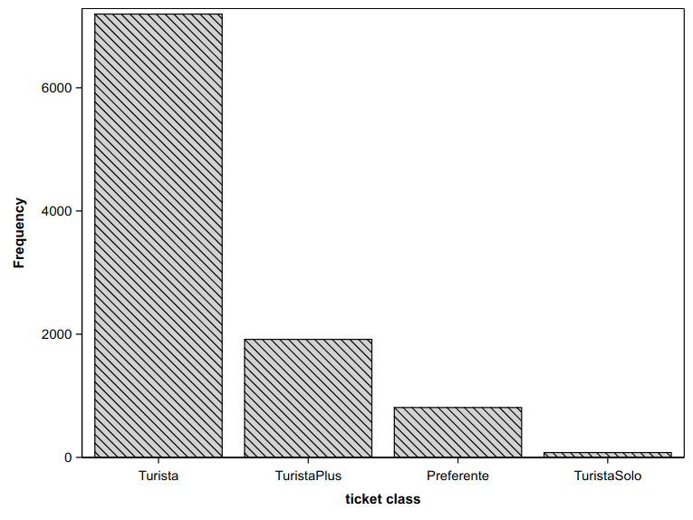
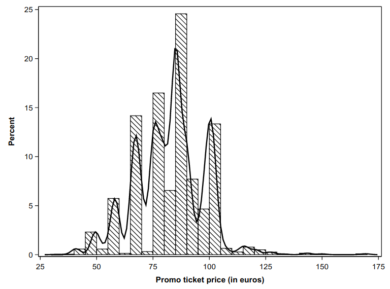
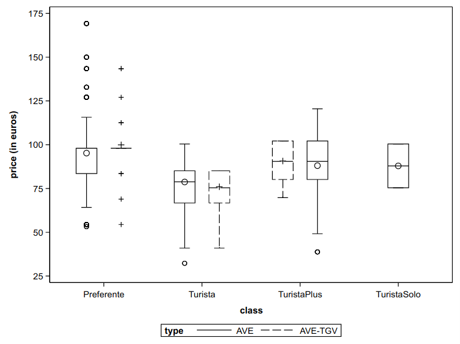
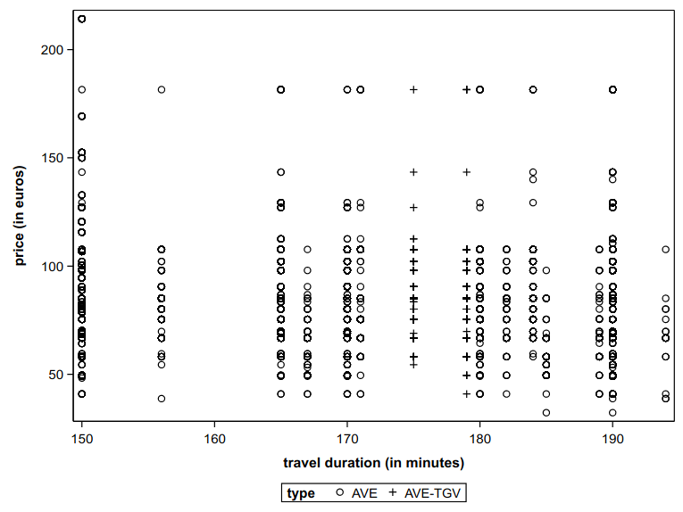

```{r child = "setup.Rmd"}
```

```{r set-theme, include=FALSE}
library(xaringanthemer)
style_duo_accent(
  primary_color      = "#003C71", # pantone classic blue
  secondary_color    = "#009FDF", # pantone baby blue
  header_font_google = google_font("Raleway","700"),
  text_font_google   = google_font("Raleway", "400", "400i"),
  code_font_google   = google_font("Source Code Pro"),
  text_font_size     = "30px"
)
```


```{r load-packages, message=FALSE, echo=FALSE}
knitr::opts_chunk$set(echo = TRUE, 
                      message = FALSE, 
                      warning = FALSE, 
                      out.width = '70%', 
                      fig.align = 'center', 
                      tidy = FALSE)
options(scipen = 1, digits = 3)
library(ggplot2, warn.conflicts = FALSE, quietly = TRUE)
library(poorman, quietly = TRUE)
library(viridis)
theme_set(theme_minimal())
options(ggplot2.continuous.colour="viridis")
options(ggplot2.continuous.fill = "viridis")
scale_colour_discrete <- scale_colour_viridis_d
scale_fill_discrete <- scale_fill_viridis_d

url <- "https://lbelzile.bitbucket.io/MATH60604A/renfe.sas7bdat"
renfe <- haven::read_sas(url)
#Identifier les variables catégorielles
renfe <- renfe %>% 
  mutate(dest = factor(recode(dest, "0" = "Barcelone-Madrid",
               "1" = "Madrid-Barcelone")),
         type = factor(type),
         dest = factor(dest),
         wday = factor(wday),
         fare = factor(fare),
         class = factor(class))
```

```{r xaringanExtra, echo=FALSE}
xaringanExtra::use_xaringan_extra(c("tile_view", "editable","panelset", "webcam"))
htmltools::tagList(
  xaringanExtra::use_clipboard(
    button_text = "<i class=\"fa fa-clipboard\"></i>",
    success_text = "<i class=\"fa fa-check\" style=\"color: #90BE6D\"></i>",
    error_text = "<i class=\"fa fa-times-circle\" style=\"color: #F94144\"></i>"
  ),
  rmarkdown::html_dependency_font_awesome()
)
xaringanExtra::use_extra_styles(
  hover_code_line = TRUE,         #<<
  mute_unhighlighted_code = TRUE  #<<
)
```

# Type of data

Data base typically comprise many different *variable types*.

Distinguishing between the later is needed for

- correct model choice,
- proper graphical representation,
- interpretation of effects.

---


## Numerical variables

```{r variablesquanti, echo = FALSE, out.width="55%"}
knitr::include_graphics('img/EDA/continuous_discrete.png')
```


.center[
.small[
Drawing by Allison Horst of continuous (left) and discrete (right) numerical variables.
]
]

---

## Categorical variables

```{r variablescateg, echo = FALSE}
knitr::include_graphics('img/EDA/nominal_ordinal_binary.png')
```
.center[
.small[
Drawing by Allison Horst of nominal (left), ordinal (middle) and binary (right) categorical variables.
]
]

---

## Graphics and data


> *The simple graph has brought more information to the data analyst's mind than any other device.*  
.right[— John Tukey]

--

### What is a good graph?

> *Graphical excellence consists of complex ideas communicated with clarity, precision, and efficiency ... Graphical excellence is that which gives to the viewer the greatest number of ideas in the shortest time with the least ink in the smallest space.*  
.right[— Tufte, 1983]


---

## Grammar of graphics

> Wilkinson, L. (2005), *The Grammar of Graphics(2nd ed.)* Statistics and Computing, New York: Springer.


- Elements (layers):
    - data
    - mapping (variables -> aesthetics)
    - geometric objects
    - transformations
    - positioning
- Scale / guide
- Coordinates (facets, coordinate system)


---

Some golden rules for effective visualization


### Rule 1: the choice of graphic depends on the variable type


--
<br>

#### One variable


.midi[
- continuous: histogram/density plot
- discrete: bar plot
- categorical: bar plot (frequency or percentage)
]

--

#### Two variables
.midi[
- continuous: scatterplot
- categorical: bar plots (one group via color), heatmap
- continuous $\times$ categorical: box-and-whisker plot, violin plot
]

---

.panelset[


.panel[.panel-name[**R** graph]

.center[.small[Renfe data: bar plot of ticket class]]
```{r renfe_barplot, eval = TRUE, echo = FALSE}
ggplot(data = renfe, 
       aes(x = forcats::fct_infreq(class))) + 
  geom_bar() +
  geom_text(stat='count', aes(label=..count..), vjust=-0.5) +
  labs(x = "class", 
       y = "count")  +
  scale_y_continuous(expand = c(.125, 0)) + 
  theme(panel.grid.major.x = element_blank())
```

]
.panel[.panel-name[**R** code]

#### One categorical variable: bar plot

```{r renfe_barplot_code, eval = FALSE, echo = TRUE}
ggplot(data = renfe, 
       aes(x = forcats::fct_infreq(classe))) + 
  geom_bar() +
  geom_text(stat='count', aes(label=..count..), vjust=-0.5) +
  labs(x = "class", 
       y = "count")  +
  scale_y_continuous(expand = c(.125, 0)) + 
  theme(panel.grid.major.x = element_blank())
```
.small[
- Order values by frequency.
- If the labels are too long, rotate the axis (`+ coord_flip()`).
]
]

.panel[.panel-name[**SAS** graph]


```{r renfe_barplot_sas, echo = FALSE, out.width="55%"}

```

]

.panel[.panel-name[**SAS** code]

```{sas renfe_barplot_sas_code, eval = FALSE, echo = TRUE}
proc sgplot data=statmod.renfe;
vbar class / categoryorder=respdesc;
xaxis label="ticket class";
run;
```

]

]

---

.panelset[

.panel[.panel-name[**R** graph]

.center[
.small[Renfe data: histogram of Promo ticket price
]
]
```{r renfe_hist, eval = TRUE, echo = FALSE, fig.width = 8, fig.height = 4.2}
renfe %>% subset(fare == "Promo") %>%
  ggplot(aes(x = price)) + 
    geom_histogram(aes(y = ..density..), bins = 30) +
    geom_density() + 
    geom_rug(sides = "b") + 
    labs(x = "price of Promo tickets (in euros)", 
         y = "density") 
```

]
.panel[.panel-name[**R** code]

#### One continuous variable: histogram/density

```{r renfe_hist_code, eval = FALSE, echo = TRUE}
renfe %>% subset(fare == "Promo") %>%
  ggplot(aes(x = price)) + 
    geom_histogram(aes(y = ..density..), bins = 30) +
    geom_density() + 
    geom_rug(sides = "b") + 
    labs(x = "price of Promo tickets (in euros)", 
         y = "density") 
```

]


.panel[.panel-name[**SAS** graph]

```{r renfe_hist_sas, echo = FALSE, out.width="55%"}

```

]

.panel[.panel-name[**SAS** code]

```{sas renfe_hist_sas_code, eval = FALSE, echo = TRUE}
data renfe_promo;
set statmod.renfe;
where fare="Promo";
run;

proc sgplot data=renfe_promo noautolegend;
histogram price;
density price / type=kernel;
xaxis label = "Promo ticket price (in euros)";
run;
```
]


]

---

.panelset[
.panel[.panel-name[**R** graph]

.center[
.small[
Renfe data: box-and-whiskers plot of Promo tickets price as a function of class
]
]

```{r renfe_boxplot, cache = TRUE, echo = FALSE, out.width="55%"}
renfe %>% subset(fare == "Promo") %>%
    ggplot(aes(y = price, x = class, col = type)) + 
    geom_boxplot() + 
    labs(y = "price (in euros)", col = "train type") + 
    theme(legend.position = "bottom") +
    scale_colour_viridis_d()
```

]
.panel[.panel-name[**R** code]


#### Two variables (continuous and categorical): boxplot

```{r renfe_boxplot_code, echo = TRUE, eval = FALSE}
renfe %>% subset(fare == "Promo") %>%
    ggplot(aes(y = price, x = class, col = type)) + 
    geom_boxplot() + 
    labs(y = "price (in euros)", col = "train type") + 
    theme(legend.position = "bottom") +
    scale_colour_viridis_d()
```

.small[

- We added a categorical variable (`type`) through use of colour.
- Use an appropriate color palette (for color-blind people and for black and white printing).
]

]


.panel[.panel-name[**SAS** graph]

```{r renfe_boxplot_sas, echo = FALSE, out.width="55%"}

```

]

.panel[.panel-name[**SAS** code]

```{sas renfe_boxplot_sas_code, eval = FALSE, echo = TRUE}
proc sgplot data=renfe_promo;
vbox price / category=class group=type;
yaxis label = "price (in euros)";
run;
```
]


]
---

.panelset[

.panel[.panel-name[**R** graph]

.center[
.small[
Renfe data: scatterplot of ticket price as a function of travel time for high speed trains
]
]

```{r renfe_nuagepts, cache = TRUE, echo = FALSE, out.width="55%"}
renfe %>% subset(type != "REXPRESS") %>%
    ggplot(aes(x = duration, y = price, col = type)) + 
    geom_point() + 
    labs(y = "price (in euros)", 
         x = "travel duration (in minutes)",
         col = "train type") + 
    theme(legend.position = "bottom") +
    scale_colour_viridis_d()
```

]
.panel[.panel-name[**R** code]


#### Two continuous variables and one categorical variable: scatterplot


```{r renfe_nuagepts_code, echo = TRUE, eval = FALSE}
renfe %>% subset(type != "REXPRESS") %>%
    ggplot(aes(x = duration, y = price, col = type)) + 
    geom_point() + 
    labs(y = "price (in euros)", 
         x = "travel duration (in minutes)",
         col = "train type") + 
    theme(legend.position = "bottom") +
    scale_colour_viridis_d()
```

.midi[
What is wrong with the previous display?


How could we fix the graph?
]

]

.panel[.panel-name[**SAS** graph]

```{r renfe_nuagepts_sas, echo = FALSE, out.width="55%"}

```

]

.panel[.panel-name[**SAS** code]

```{sas renfe_nuagepts_sas_code, eval = FALSE, echo = TRUE}
data renfe_ave;
set statmod.renfe;
where type NE "REXPRESS";
run;

proc sgplot data=renfe_ave;
scatter y=price x=duration / group=type;
xaxis label="travel duration (in minutes)";
yaxis label="price (in euros)";
run;
```
]

]

---


### Rule 2: A graph tells a story by itself

Your graphic must be standalone with the legend.

- some visualization choices are more effective/adequate than others
- include both variable name **and** units if ambiguous
- add a description in the text and cross-reference
- pay attention to scale (adequate font size for legibility) 

---

### Rule 3: pay attention to human visual perception

Avoid junk chart

+ ratio length/width
+ spacing between bands
+ axis limits (with or without zero)
+ choice of color (grayscale, color-blind friendly palettes)
+ comparing areas is difficult
+ avoid 3D graphs / rotation

---


# Graphical exploratory data analysis


> *Numerical quantities focus on expected values, graphical summaries on unexpected values.*   
.right[— John Tukey]

- Ask questions related to the data
- Look for answers using graphs
- Infirm or confirm your intuitions
- Refine questions based on preliminary findings
- Rinse and repeat
- Write a summary of key findings


---

### References

- [*Fundamentals of Data Visualization* par Claus O. Wilke](https://serialmentor.com/dataviz/)
- [Chapter 3 of _**R** for Data Science_ by Garrett Grolemund and Hadley Wickham](https://r4ds.had.co.nz/)
- [Chapter 1 of *Data Visualization: A practical introduction* by Kieran Healy](https://socviz.co/lookatdata.html#lookatdata)
