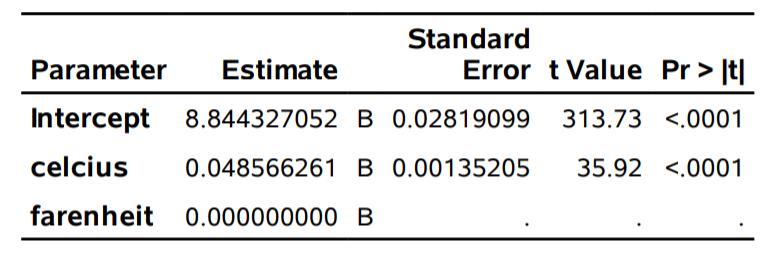

```{r set-theme, include=FALSE}
library(xaringanthemer)
style_duo_accent(
  primary_color      = "#003C71", # pantone classic blue
  secondary_color    = "#009FDF", # pantone baby blue
  header_font_google = google_font("Raleway","700"),
  text_font_google   = google_font("Raleway", "400", "400i"),
  code_font_google   = google_font("Source Code Pro"),
  text_font_size     = "30px"
)
```


```{r load-packages, message=FALSE, echo=FALSE}
knitr::opts_chunk$set(echo = TRUE, 
                      message = FALSE, 
                      warning = FALSE, 
                      out.width = '70%', 
                      fig.align = 'center', 
                      tidy = FALSE)

```

```{r xaringanExtra, echo=FALSE}
xaringanExtra::use_xaringan_extra(c("tile_view", "editable","panelset", "webcam"))
xaringanExtra::use_extra_styles(
  hover_code_line = TRUE,         #<<
  mute_unhighlighted_code = TRUE  #<<
)
```


## Linear transformations

Consider the log number of Bixi rentals per day as a function of the temperature in degrees Celcius (or in Farenheit).

Suppose that the true effect of temperature on log of bike rentals is 
\begin{align*}
\texttt{lognuser} = \alpha_0+ \alpha_1 \texttt{celcius} + \varepsilon.
\end{align*}

- The interpretation of $\alpha_1$: *the average increase in the number of log rental per day when temperature increases by $1^{\circ}\mathrm{C}$ *.

The model for log-rentals with temperature expressed in Farenheits is
\begin{align*}
\texttt{lognuser} = \gamma_0 + \gamma_1\texttt{farenheit} + \varepsilon.
\end{align*}

---

## **SAS** output

```{r bixitemp1, echo = FALSE, out.width = '60%'}
knitr::include_graphics(
  c('img/c2/slides3-e20.png', 'img/c2/slides3-e21.png')
  )
```

The two units are **linearly** related,
\begin{align*}
1.8 \texttt{celcius} + 32 = \texttt{farenheit}.
\end{align*}
so we find that $\alpha_0=\gamma_0 + 32\gamma_1$ and $\alpha_1=1.8\gamma_1$.

---

## Uniqueness of the solution

The parameters of the postulated linear model with both predictors, 
\begin{align*}
\texttt{lognuser} = \beta_0 + \beta_{\texttt{c}} \texttt{celcius} + \beta_{\texttt{f}} \texttt{farenheit} + \varepsilon,
\end{align*}
are not **identifiable**, since any linear combination of the two solutions give the same fitted values.

For $k \in \mathbb{R}$, $\beta_0 = k\alpha_0 + (1-k)\gamma_0$, $\beta_1=k\alpha_1$ and $\beta_2=(1-k)\gamma_1$ are equivalent.

The rank of $\mathbf{X}$ is 2, but the design matrix has 3 columns  

- $\mathbf{X}^\top\mathbf{X}$ is not invertible.
- the solution to the normal equation is **not unique**.

---

### Collinearity

```{r bixitemp2, echo = FALSE, out.width="60%"}

```

**SAS** prints a warning if the data are exactly collinear.
> `Note: The X'X matrix has been found to be singular, and a generalized inverse was used to solve the normal equations. Terms whose estimates are followed by the letter 'B' are not uniquely estimable.`

