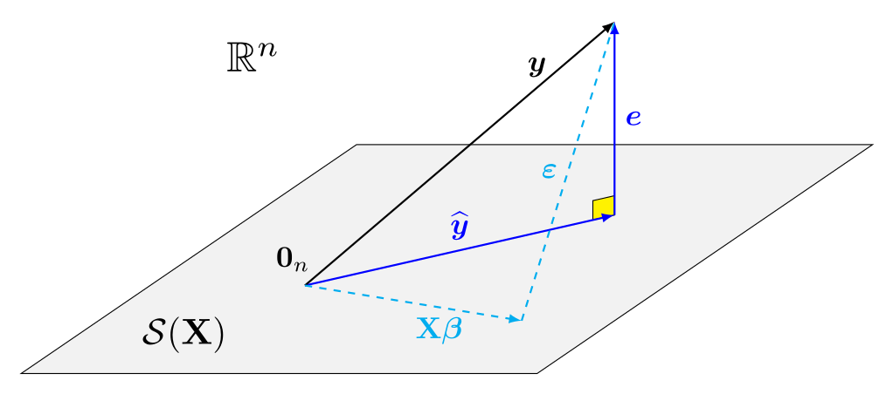

  
  
```{r set-theme, include=FALSE}
library(xaringanthemer)
style_duo_accent(
  primary_color      = "#003C71", # pantone classic blue
  secondary_color    = "#009FDF", # pantone baby blue
  header_font_google = google_font("Raleway","700"),
  text_font_google   = google_font("Raleway", "400", "400i"),
  code_font_google   = google_font("Source Code Pro"),
  text_font_size     = "30px"
)
```


```{r load-packages, message=FALSE, echo=FALSE}
knitr::opts_chunk$set(echo = TRUE, 
                      message = FALSE, 
                      warning = FALSE, 
                      out.width = '70%', 
                      fig.align = 'center', 
                      tidy = FALSE)

```

```{r xaringanExtra, echo=FALSE}
xaringanExtra::use_xaringan_extra(c("tile_view", "editable","panelset", "webcam"))
xaringanExtra::use_extra_styles(
  hover_code_line = TRUE,         #<<
  mute_unhighlighted_code = TRUE  #<<
)
```

## Linear algebra reminders

For an $n\times p$ matrix, the column space of $\mathbf{X}$ is 
\begin{align*}
\mathcal{S}(\mathbf{X}) =\{\mathbf{X}\boldsymbol{a}, \boldsymbol{a} \in \mathbb{R}^p\}
\end{align*}

The linear model equation
\begin{align*}
\boldsymbol{Y} = \mathbf{X} \boldsymbol{\beta} + \boldsymbol{\varepsilon}
\end{align*}
corresponds to an (unknown) element of the span of $\mathbf{X}$ plus a disturbance.

---

## Ordinary least squares

Find the element of $\mathcal{S}(\mathbf{X})$ with the minimum distance from $\boldsymbol{y}$ (ordinary least squares), i.e. 
\begin{align*}
\widehat{\boldsymbol{\beta}} = \min_{\boldsymbol{\beta} \in \mathbb{R}^p} \|\boldsymbol{y} - \mathbf{X} \boldsymbol{\beta}\|^2
\end{align*}

Intuition: $\varepsilon_1, \ldots, \varepsilon_n$ and $\beta_0, \ldots, \beta_{p-1}$ are unknown, but we cannot retrieve them ( $n$ observations, $n+p$ unknowns).

---

## Column geometry

We try to find the best $p$-dimensional approximation onto $\mathcal{S}(\mathbf{X})$.

```{r olsgeom, echo = FALSE, out.width="70%"}

```
The solution to the least square problem is the projection of $\boldsymbol{y}$ onto $\mathcal{S}(\mathbf{X})$, i.e., $\mathbf{H}\boldsymbol{y}$, where $\mathbf{H}=\mathbf{X}(\mathbf{X}^\top\mathbf{X})^{-1}\mathbf{X}^\top$.

---

### Orthogonal decomposition

Write 
\begin{align*}
\boldsymbol{y} &= \mathbf{H}\boldsymbol{y} + (\mathbf{I}_n-\mathbf{H})\boldsymbol{y}
\\ &=
\mathbf{X}\widehat{\boldsymbol{\beta}} + \boldsymbol{e}
\end{align*}

The residuals $\boldsymbol{e}$ are orthogonal to the columns of $\mathbf{X}$ and the fitted values $\widehat{\boldsymbol{y}}=\mathbf{X}\widehat{\boldsymbol{\beta}}$.

- By Pythagoras' theorem, $\|\boldsymbol{y}\|^2 = \|\widehat{\boldsymbol{y}}\|^2 + \|\boldsymbol{e}\|^2$.

Assuming $\mathbf{1}_n \in \mathcal{S}(\mathbf{X})$ (intercept included)
- The sample mean of $\boldsymbol{e}$ is zero.
- A linear regression of $\widehat{\boldsymbol{y}}$ onto $\boldsymbol{e}$ has zero intercept and slope (they are uncorrelated).


