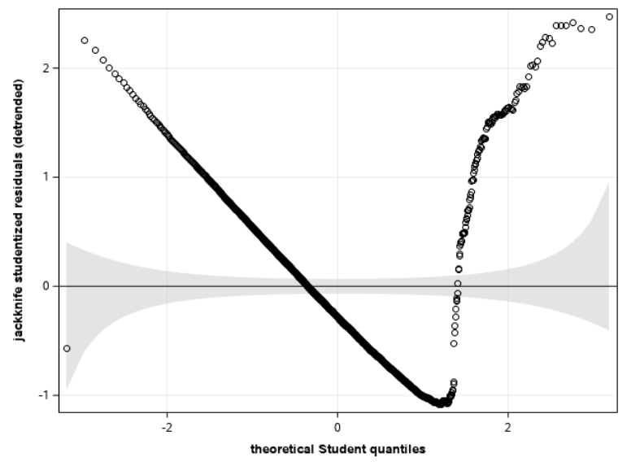

```{r set-theme, include=FALSE}
library(xaringanthemer)
style_duo_accent(
  primary_color      = "#003C71", # pantone classic blue
  secondary_color    = "#009FDF", # pantone baby blue
  header_font_google = google_font("Raleway","700"),
  text_font_google   = google_font("Raleway", "400", "400i"),
  code_font_google   = google_font("Source Code Pro"),
  text_font_size     = "30px"
)
```


```{r load-packages, message=FALSE, echo=FALSE}
knitr::opts_chunk$set(echo = TRUE, 
                      message = FALSE, 
                      warning = FALSE, 
                      out.width = '70%', 
                      fig.align = 'center', 
                      tidy = FALSE)

```

```{r xaringanExtra, echo=FALSE}
xaringanExtra::use_xaringan_extra(c("tile_view", "editable","panelset", "webcam"))
xaringanExtra::use_extra_styles(
  hover_code_line = TRUE,         #<<
  mute_unhighlighted_code = TRUE  #<<
)
```

## Model assumptions

We postulate $\varepsilon_i \sim \mathsf{No}(0,\sigma^2)$ are independent errors.

- independence
- linearity
- homoscedasticity (equal variance)
- normality


---

### Assumptions revisited

1. **Independence**: the errors $\varepsilon_1, \ldots, \varepsilon_n$ are independent (thus, so are the observations)
2. **Linearity**: the expectation of the errors is $\mathsf{E}(\varepsilon_i)=0$ for all $i=1, \ldots, n$.
  - this implies that the mean model is correctly specified, so $\mathsf{E}(Y \mid  \mathbf{X})=\beta_0+\beta_1\mathrm{X}_1+\cdots + \beta_p \mathrm{X}_p$
  - all the important explanatory variables have been included in the model
  - and their effects (presumed linear) have been properly captured by the model.
3. **Homoscedasticity**: the variance of the errors is **constant** $\mathsf{Va}(\varepsilon_i)=\sigma^2$ for $i=1, \ldots, n$.
  - the variance of $Y_i$ is constant and does not depend on $\mathbf{X}$.
3. **Normality**: the error terms $\boldsymbol{\varepsilon}$ follows a normal distribution.

---

### Default graphics

- Use options `plots=diagnostics residuals(smooth)` to get default residual diagnostic plots and plots of residuals against continuous explanatories.
 
In **SAS**, we can save additional objects from the `glm` fit using the command `output`. 

- In the code excerpt, we copy (names are user-specific)
   - the fitted values `fitted`
   - the ordinary residuals `ores`
   - the jackknife studentized residuals `jsr` 
in the temporary database `resid`.

---

.panelset[

.panel[.panel-name[**SAS** code]
```{sas eval=FALSE}
ods graphics on;
proc glm data=infe.intention 
    plots=diagnostics residuals;
class sex marital educ revenue;
model intention= fixation emotion marital
    sex age revenue educ / ss3 solution;
output out=resid predicted=fitted 
    r=ores rstudent=jsr;
run;
```

]

.panel[.panel-name[**SAS** output (1)]
```{r xvsresid_sas1, echo = FALSE, out.width="55%"}

```
]
.panel[.panel-name[**SAS** output (2)]
```{r xvsresid_sas2, echo = FALSE, out.width="45%"}

```
]

]

---

### Review of graphs (clockwise from top left)

- residual versus fitted values (linearity)
- Jackknife studentized residuals against fitted values (heteroscedasticity)
- Leverage plot (shows influence of observation on estimators)
- quantile-quantile plot of residual (normality)
- scatterplot of $Y_i$ versus $\hat{Y}_i$ (linearity, but depends on $R^2$)
- Cook's distance plot (used to detect outliers)
- Density and histogram of ordinary residuals (normality)

---

 In this example, the analysis of residual does not give us any reason to doubt the model assumptions. Therefore, we can be confident in the results of our analysis (hypothesis tests and confidence intervals).
 
---

## Creating plots by hand: correlogram (ACF)

.panelset[

.panel[.panel-name[Context]

- The `airpassengers` data contains monthly observations of the air traffic in the 1960s.
- We fit a linear model with month (categorical) and year (continuous) for log of the number of passengers.
- The autocorrelation function (ACF) shows there is residual dependence at different lags, both monthly and yearly dependence.

]
.panel[.panel-name[Correlogram]
```{r acfplot_sas, echo = FALSE, out.width="55%"}

```
]
.panel[.panel-name[**SAS** code]
Only use this plot if you have a time series!

```{sas acf, eval = FALSE}
data airpassengers;
set statmod.airpassengers;
lnpassenger = log(passengers);
run;

proc glm data=airpassengers;
model lnpassenger = month year;
output out=airpassresid r=residuals;
run;

proc timeseries data=airpassresid plots=acf;
var residuals;
run;
```
]
]

---

## Linearity assumption

Many potential graphs of ordinary residuals...

- against fitted values
- against explanatories
- against omitted covariates (not included in the mean model)
- added-variable plots

---

### Insurance data

Consider a linear model with `age`, `sex`, `region` and the interaction between `smoker`/`obesity` and `bmi`.

- The plots show that our model is inadequate, but this can lead to wrong diagnostics: 
  - because of unexplained (abnormally high) charges, the line for e.g., non smoker is too high.
  - most data are well captured, but this impact quantile-quantile plot.
  - a log-transformation could reduce the impact of these abnormal values (smaller differences), or else robust regression

---


.panelset[

## Linearity

.panel[.panel-name[**SAS** output]

```{r insurance_fittedores, echo = FALSE, out.width="55%"}

```
]
.panel[.panel-name[**SAS** code]


```{sas codefittedvsores, eval = FALSE}
proc glm data=insurance;
class smobese sex region;
model charges = smobese|bmi age sex region / solution ss3;
output out=resid predicted=fitted 
    r=ores rstudent=jsr;
run;
    
*Plot ordinary residuals against fitted values;
proc sgplot data=resid noautolegend;
scatter y=ores x=fitted;
loess y=ores x=fitted; 
xaxis label="fitted values";
yaxis label="ordinary residuals";
run;
```
]
]

---

## Linearity

.panelset[
.panel[.panel-name[**SAS** output (1)]

```{r insurance_bmiores, echo = FALSE, out.width="55%"}

```

No structure in the residual against body mass index.

]

.panel[.panel-name[**SAS** output (2)]

```{r insurance_childrenores, echo = FALSE, out.width="55%"}

```

A trend (linear?) with the number of children, but scarse data above 4 children.

]
.panel[.panel-name[**SAS** code]


```{sas codebmivsores, eval = FALSE}

/* Plot ordinary residuals against body mass index */
proc sgpanel data=resid noautolegend;
panelby smoker / uniscale=row;
scatter y=ores x=bmi;
loess y=ores x=bmi; 
rowaxis label="ordinary residuals";
colaxis label ="body mass index";
run;

/* Plot residuals against omitted variable */
proc sgpanel data=resid noautolegend;
panelby sex / uniscale=row;
vbox  ores / category=children;
scatter  x=children y=ores / jitter transparency=0.6;
colaxis label="number of children";
rowaxis label="ordinary residuals"; 
run;
```
]
]

---

## Linearity (2)

.panelset[
.panel[.panel-name[**SAS** output (1)]

```{r insurance_jsr, echo = FALSE, out.width="55%"}

```

No evidence of increase in variance

]

.panel[.panel-name[**SAS** output (2)]

```{r insurance_boxplot, echo = FALSE, out.width="55%"}

```

No group heteroscedasticity (but more unexplained records for non-smokers).
]
.panel[.panel-name[**SAS** code]


```{sas codejsrhetero, eval = FALSE}
data resid;
set resid;
ajsr = abs(jsr);
run;

proc sgplot data=resid noautolegend;
scatter y=ajsr x = fitted;
loess y=ajsr x = fitted;
yaxis label = "|jackknife studentized residuals|";
xaxis label = "fitted values";
run;

proc sgplot data=resid noautolegend;
vbox jsr / category=smobese;
yaxis label = "jackknife studentized residuals";
xaxis label = "smoker/obese status";
run;
```
]
]

---

### Quantile-quantile plots


To create a quantile-quantile plot manually

- sort the data (jackknife studentized residuals)
- compute plotting positions $i/(n+1)$, $i=1, \ldots, n$
- calculate inverse transform $F^{-1}\{i/(n+1)\}$, where $F^{-1}$ is the quantile function of the postulated distribution. 
- add approximate pointwise confidence bands (computed using order statistics)
    - $U_{(j)} \sim \mathsf{Be}(j, n+1-j)$
    - therefore pick $0.025$ and $0.975$ quantiles of $\mathsf{Be}(j, n+1-j)$
    - back-transform to Student
    - detrend

---


### Normality

.panelset[

.panel[.panel-name[**SAS** output]

```{r insurance_qq, echo = FALSE, out.width="55%"}

```


]
.panel[.panel-name[**SAS** code (1)]


```{sas codeqq, eval = FALSE}
data residqq; 
set resid;
keep jsr;
run;

proc sort data=residqq;
by jsr; 
run;

data residqq;
set residqq nobs=nobs;
pp = _N_  / (nobs + 1);
pplow = quantile("beta", 0.025, _N_, nobs + 1 - _N_);
pphigh = quantile("beta", 0.975, _N_, nobs + 1 - _N_);
q = quantile("t", pp, 1329);
qlow = quantile("t", pplow, 1329);
qhigh = quantile("t", pphigh, 1329);
qdet = jsr - q;
qdethigh = qhigh - q;
qdetlow = qlow - q;
run;
```

]
.panel[.panel-name[**SAS** code (2)]

```{sas codeqq2, eval = FALSE}
proc sgplot data=residqq noautolegend; 
band x=q upper=qdethigh lower=qdetlow / 
  fill transparency=.5 
  legendlabel="pointwise confidence intervals";
lineparm x=0 y=0 slope=0; 
scatter x=q y=qdet;
xaxis label="theoretical Student quantiles" grid; 
yaxis label="jackknife studentized residuals (detrended)" grid;
run;
```
]
]

---

## Quantile-quantile plots

- `proc univariate` also supports a limited number of distributions, including the normal distribution.
- You could use the normal approximation to the Student-t distribution  provided the degrees of freedom parameter $n-p-2$ are large (greater than 20).

```{sas qqplothist, eval = FALSE}
/* Histogram of jackknife studentized residuals
	with density estimate */
proc sgplot data=resid;
histogram jsr;
density jsr / type=kernel;
keylegend / position=bottom;
run;

proc univariate data=resid noprint;
qqplot jsr / normal(mu=est sigma=est l=2)
square;
run;
```